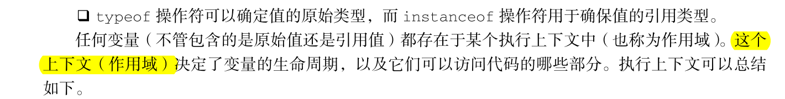

# 函数

函数就是完成某个功能的一组语句，函数由关键字 function + 函数名 + 一组参数定义;

函数在定义后可以被重复调用，通常将常用的功能写成一个函数，利用函数可以使代码的组织结构更多清晰。

## 基本语法
```js
//非匿名函数
function functionname(){
    // 执行代码
}
//匿名函数
let fn = funciton(){

}
//调用
functionname()
fn()
```

## 调用带参数的函数
```js
function say(name='z', age=33) {
    console.log("我是" + name + ", 我今年" + age + "岁了。");
}//name, age 形参
say('gzp',111)//'gzp',111为实参
//我是gzp我今年111岁了。
```

## return

在使用 return 语句时，函数会停止执行，并返回指定的值。

函数如果没有写 retrun 语句的话, 默认是在函数体最后面 retrun;， 也就是函数默认的返回值是 undefined

## 作用域
红宝书中，作用域约等于上下文

### 全局作用域
document下 的内容
全局作用域的函数方法在网页销毁时销毁

### 局部作用域
函数体内的内容
局部作用域的函数在调用完就销毁
#### 变量的声明提前
<p>用了var定义的变量或函数的参数，都会被提前到函数体的顶部进行声明</p>
<span style="color:red;font-size:20px"> (但不涉及赋值,具体赋值还是需要运行到对应行数)</span>


```js
var scope = "global";
function f() {
    console.log(scope); // =>undefined             输出"undefined"，而不是"global" 
    var scope = "local"; // 变量 在这里 赋 初始 值， 但 变量 本身 在函数体内任何地方均是有定义的
    console.log(scope);     // =>"local"
}
//相当于 函数内的 scope 在局部作用域内声明提升，scope是局部作用域内的undefined，而读取不到全局作用域的scope
```
### 块级作用域(ES6)
let 关键字，它的作用域是块级的，这也是 JavaScript 中的新概念。块
级作用域由最近的一对包含花括号 {} 界定。换句话说， if 块、 while 块、 function 块，甚至连单独的块也是 let 声明变量的作用域。
