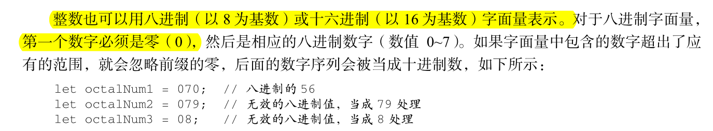
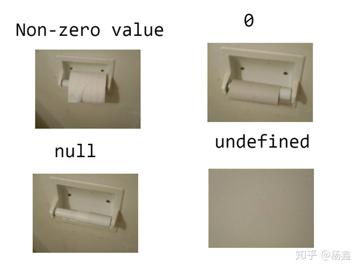

# 变量的类型
变量分为两大数据类型

# 原始类型(primitive type)
字符串、数字、布尔值、undefined、null、Symbol、BigInt(ECMAScript2020 新加)</br>

 

## 字符串(string)
由单引号''、双引号""或反单引号``括起来的有序字符，就叫字符串

```Javascript
'123'
'aaa'
```

## 数字(number)
整数+浮点数=数值类型 <br/>
表示的整数范围是-2^53 至 2^53<br/>
超出范围:Infinity <br/>
非数字:NaN<br/>

整数也可以用八进制（以 8 为基数）或十六进制（以 16 为基数）字面量表示

```javascript
let octalNum1 = 070;  // 八进制的 56 
let octalNum2 = 079;  // 无效的八进制值，当成 79 处理 
let octalNum3 = 08;   // 无效的八进制值，当成 8 处理 
```

第一个数字必须是零（0），然后是相应的八进制数字（数值 0~7）。



以0开头的数字类型优先级都是把其先转换，所以后端不可以传这种数据，还有JavaScript的输入，都会转成string形式，感觉以此来规避这个bug，

在严格模式下，这种写法会报错。

## 布尔值(boolean)

布尔类型的变量只有两个值，分别是保留字true和false
## undefined
没有设置值的变量,一般只是用来判断该值是否赋值，红宝书不建议赋值undefined
## null
是一个只有一个值的特殊类型。表示一个空对象引用。
可以收到实现垃圾销毁
## Symbol
一个symbol值能作为对象属性的标识符，返回的值是唯一的，一般伴随对象而生（目前还未看懂）<br />
阮一峰讲Symbol:<a href="https://es6.ruanyifeng.com/#docs/symbol">https://es6.ruanyifeng.com/#docs/symbol</a>

## BigInt
ECMAScript2020新增的原始类型<br />
Js 中 Number类型只能安全的表示-(2^53-1)至 2^53-1 范的值，即Number.MINSAFEINTEGER 至Number.MAXSAFEINTEGER，超出这个范围的整数计算或者表示会丢失精度。<br />
```Javascript
//使用方法 
//在整数后加n
let bigIntNum = 9007199254740993n;
let bigNumRet = 9007199254740993n+ 9007199254740993n; // =>18014398509481986n
typeof 9007199254740993n; // => 'bigint'
```
尽可能避免通过调用函数 BigInt 方式来实例化超大整型。因为参数的字面量实际也是 Number 类型的一次实例化，超出安全范围的数字，可能会引起精度丢失

## 知乎看到一幅分辨 null 和 undefined 的图

