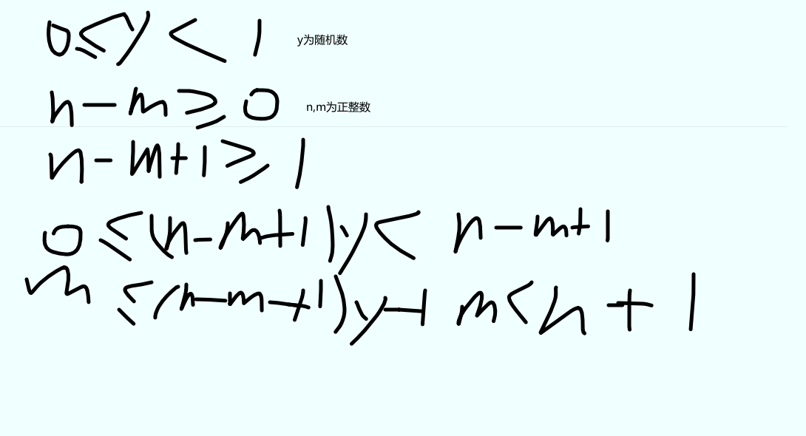

# 常用的js自带方法
## Math

### Math.random()
如果你希望生成任意值到任意值的随机数，公式就是这样的：

Math.floor(Math.random()*(max-min+1)+min);
<br/>
因为有Math.floor()所以  Math.floor(m) = m, Math.floor(n+1) = n <br/>
以上 就是 m向下取整还是m， n+1向下取整为n(左边为小于号所以永远娶不到)

### Math.PI

返回圆周率

### Math.sqrt

返回开方

## Number

### toFixed()

返回包含指定小数点位数的数值字符串
### toExponential() 
返回以科学记数法

```javascript
let num = 10; 
console.log(num.toFixed(2)); // "10.00" 
```

### isInteger()

ES6 新增了 Number.isInteger() 方法，用于辨别一个数值是否保存为整数。

```javascript
console.log(Number.isInteger(1));    // true 
console.log(Number.isInteger(1.00)); // true 
console.log(Number.isInteger(1.01)); // false 
```

## String

### 字符串操作方法 

concat()、 slice() 、 substr() 和 substring()

#### concat()

合并字符串


```javascript
let stringValue = "hello "; 
let result = stringValue.concat("world", "!"); 
 
console.log(result);      // "hello world!" 
console.log(stringValue); // "hello" 
```

####  slice() 

剪切字符串 slice(str1Position,str2Position)

参数为负数时候,将所有负值参数都当成字符串长度加上负参数值。

```javascript
let stringValue = "hello world"; 
console.log(stringValue.slice(-3));         // "rld" 
console.log(stringValue.slice(3, -4));      // "lo w"  =>console.log(stringValue.slice(3, 7)); 
```


#### substring() 

剪切字符串 substring(str1Position,str2Position)  

输出不包含str2Position

会将所有负参数值都转换为 0

```javascript
let stringValue = "hello world"; 
console.log(stringValue.substring(-3));     // "hello world" => console.log(stringValue.substring(0)) 相对于一整句
console.log(stringValue.substring(3, -4));  // "hel"  => console.log(stringValue.substring(3，0)) => 
										//console.log(stringValue.substring(0,3))
```


#### substr()

剪切字符串 substr(str1Position,length)  

将第一个负参数值当成字符串长度加上该值，将第二个负参数值转换为 0。

```javascript
let stringValue = "hello world"; 
console.log(stringValue.substr(-3));        // "rld" 
console.log(stringValue.substr(3, -4));     // "" (empty string) =>console.log(stringValue.substr(3, 0)); 
```

### 字符串位置方法 

搜索传入的字符串，并返回位置（如果没找到，则返回 -1 ）

#### indexOf

从字符串开头开始查找子字符串

#### lastIndexOf

从字符串末尾开始查找子字符串

```javascript
let stringValue = "hello world"; 
console.log(stringValue.indexOf("o"));     // 4 
console.log(stringValue.lastIndexOf("o")); // 7 
console.log(stringValue.indexOf("o", 6));     // 7  从位置6（字符 "w" ）开始向后搜索字符串
console.log(stringValue.lastIndexOf("o", 6)); // 4  从位置 6 开始反向搜索至字符串开头
```

### 字符串包含方法 

ECMAScript  6 增加了 3 个用于判断字符串包含另一个字符串的方法,startsWith(),endsWith(),includes()

字符串中搜索传入的字符串，并返回一个表示是否包含的布尔值。

#### startsWith()

检查开始于索引 0 的匹配项

两个参数,从指定位置向着字符串末尾搜索

#### endsWith()

检查开始于索引 (string.length - substring.length) 的匹配项

 第二个参数，表示应该当作字符串末尾的位置

#### includes()

检查整个字符串

两个参数,从指定位置向着字符串末尾搜索

```javascript
let message = "foobarbaz"; 
 
console.log(message.startsWith("foo"));     // true 
console.log(message.startsWith("foo", 1));  // false 两个参数,从指定位置向着字符串末尾搜索
 
console.log(message.includes("bar"));       // true 
console.log(message.includes("bar", 4));    // false 两个参数,从指定位置向着字符串末尾搜索
console.log(message.endsWith("bar", 6));  // true 第二个参数，表示应该当作字符串末尾的位置
```


###   trim()方法 

删除前、后所有空格符，再返回结果。

```javascript
let stringValue = "  hello world  "; 
let trimmedStringValue = stringValue.trim(); 
console.log(stringValue);         // "  hello world " 
console.log(trimmedStringValue);  // "hello world" 
```

### repeat()

接收一个整数参数，表示要将字符串复制多少次，然后返回拼接所有副本后的结果。 

```javascript
let stringValue = "na "; 
console.log(stringValue.repeat(16) + "batman"); 
// na na na na na na na na na na na na na na na na batman 
```


## Date

## new Date()

要创建日期对象，就使用 new 操作符来调用 Date 构造函数

###  Date.now()

返回表示方法执行时日期和时间的毫秒数

```javascript
let start = Date.now();  // 1604974899493 时间戳(常用)
```


### toLocaleString() 、 toString() 和 valueOf() 方法

toLocaleString(): Date 类型的 toLocaleString() 方法返回与浏览器运行的本地环境一致的日期和时间。

 toString()：返回带时区信息的日期和时间，而时间也是以 24 小时制（0~23）表示的。

valueOf() :根本就不返回字符串，这个方法被重写后返回的是日期的毫秒表示。

```javascript
toLocaleString() - 2/1/2019 12:00:00 AM 
 
toString() - Thu Feb 1 2019 00:00:00 GMT-0800 (Pacific Standard Time) 
```

## 日期格式化方法 (个人觉得常用)

toLocaleDateString() 显示日期中的周几、月、日、年（格式特定于实现和地区）；

toLocaleTimeString() 显示日期中的时、分、秒（格式特定于实现和地区）； 

## 日期/时间组件方法 


| 方法                  | 说明                                               |
| :-------------------- | -------------------------------------------------- |
| getTime()             | 返回日期的毫秒表示；与 valueOf() 相同              |
| setTime(milliseconds) | 设置日期的毫秒表示，从而修改整个日期               |
| getFullYear()         | 返回 4 位数年（即 2019 而不是 19）                 |
| setFullYear(year)     | 设置整年                                           |
| getMonth()            | 返回月份(从0开始，所以使用要+1)                    |
| setMonth(month)       | 设置月份                                           |
| getDate()             | 返回当月日期的日(0-31)                             |
| setDate(date)         | 设置日期的日                                       |
| getDay()              | 返回日期中表示周几的数值（0 表示周日，6 表示周六） |
| getHours()            | 返回日期中的时（0~23）                             |
| getMinutes()          | 返回日期中的分（0~59）                             |
| getSeconds()          | 返回日期中的秒（0~59）                             |
|                       |                                                    |

### 转换时期代码

```javascript
function chageDateFormat(comedate) {
    let date = new Date(comedate)
    let year = date.getFullYear()
    let month = date.getMonth() + 1
    let dates = date.getDate()
    let hour = date.getHours()
    let minutes = date.getMinutes()
    let seconds = date.getSeconds()
    let days = date.getDay()//星期
    let datsArr = ['日','一','二','三','四','五','六']//星期数组
    let newDate = `${year}年${month}月${dates}日 ${hour}:${minutes}:${seconds} 星期${datsArr[days]}`
    return newDate
}
let date = new Date('2020/11/08 10:10:00').getTime()

console.log(chageDateFormat(date))//2020年11月8日 10:10:0 星期日

new Date("2016-05-31 08:00")//这种格式ie下会无效

//每月最后一天会进行转换来增加减少
let d3 = new Date()
d3.setDate(d3.getDate()+28)//28天后
console.log(d3)
```


## 自写的一个倒计时

```javascript
let timeNow = new Date().getTime() + 8 * 60 * 60 * 1000//现在时间，因为是用nodejs环境测试，暂且只补8小时服务器时间
const targetTime = new Date('2020/11/10 15:00:00').getTime()+ 8 * 60 * 60 * 1000//目标时间
let diff =targetTime -timeNow//时间戳差
let timer = null
function changeDiff(time){
    let hour =Math.floor(time /(60*60*1000)) 
    let difValue = time % ( 60 * 60 * 1000);
    let min = Math.floor(difValue/(60 * 1000)) 
    difValue =  time%(60 * 1000)
    let sec = Math.floor(difValue/1000) 
    return `${hour>10?hour+'':'0'+hour}时${min>10?min+'':'0'+min}分${sec>10?sec+'':'0'+sec}秒`
}//转换为return的 x时x秒x分

timer =  setInterval(()=>{
    console.log(changeDiff(diff))
    diff = diff-1000//每秒-1s
    if(diff<0){//diff小于0 清除定时器
        clearInterval(timer)
    }
},1000)

```

