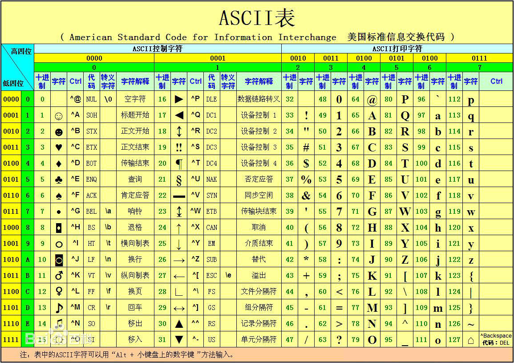

## 四则运算符
(+, -, *, /, %)


### + (合并，相加)
非全是数字的拼接，都会进行字符串拼接

```js
let a = 10, b = {"name":"bgg"}, c = [],d='1';
a + b;        //=>"10[object Object]"            
b + c;        //=>"[object Object]"            
a + d;        //=> '101'
//数字与基础类型相加
let bool = true
let boolf = false 
let unde
let x = null 
a + bool //=> 11
a + boolf // => 10
a + unde //=> NaN
a + x // => 10
```

带运算时，一般js都会把变量隐式转换
数组隐式转换是字符串

```js
let a = 1,
    b = [1,2,3],
    c = {}
a + b //=> 11,2,3
a + c // => 1[object Object]
```
### -(相减)
相当于把最后运算都转成数字类型
```js
let a = 1,
    b = 2,
    c = '3'
a - b //=> -1
a - c // => -2
1 - 'a2' // NaN
[] - 1 // -1
{} -2 // -2
5 - null // 5
1- true // 0
3 - undefined // NaN
```


### *(乘法)
把前后变量强制转成Number
```js
let a = 1,
    b = 2,
    c = '3'
a * b * c//=> 6
'string' * 3 // NaN
```

### /(除法)
把前后变量强制转成Number
```js
100 / 10 / 5 // 2
100 / {} // Infinity  把{}转成0

```

### %(取余)
把前后变量强制转成Number


## 赋值运算
(=, +=, -=, *=, /=, %=)

```js
 a += b // 相当于 a = a + b
 a -= b// 相当于 a = a - b
 //以此类推
```

##  一元运算符(++、--)
```js
var i = 10;
var a = i++;                //这里的++是在变量i后面，属于后增量,所以先进行赋值运算,a = 10, 然后i = 10 + 1;
console.log('a = ',a);        //=> 10
console.log('i = ',i);        //=> 11

a = ++i;                //这里的++是在变量i前面，属于前增量,所以先运算i = 11 + 1，然后进行赋值运算a = 12;
console.log(a);        //=> 12
console.log(i);        //=> 12
```


## 比较运算符(>, <, >=, <=, ==, !=, ===, !==)

比较运算符总会把根据比较结果，返回一个布尔值<br/>
===、!==会判断数据类型和值<br/>
```js
"u1" < "u2";    //=>true  第一个字符相等，第二个字符2大于1
//== 与 ===
```
a-zA-Z等字符ascII码<br/>
字符串比较 会对比 字母的ascII值 
```js
"abc" < "acb";    //=>true  

```
<br/>
NaN与任何比较返回都是false
```js
"u1" < "u2";    //=>true  第一个字符相等，第二个字符2大于1
//== 与 ===
10 === '10' //false
1 > NaN;    // false
1 < NaN;    // false
1 != NaN;    // false
NaN == NaN;    // false
```

## 逻辑运算符(||、&&、!)
### 与或非
与：&&<br/>
只要找到一个false 就返回第一个false<br/>
&&全为false 取第一个false或其值<br/>
&&全为true 取最后一个true或true的值<br/>
```js
a&&a+b // a为真才执行 a + b
```

或:||<br/>
只要找到一个true 就返回第一个true<br/>
全为false 取最后false<br/>
全为ture 找第一个true<br/>
```js
a||a+b // a为假才执行 a + b
```


