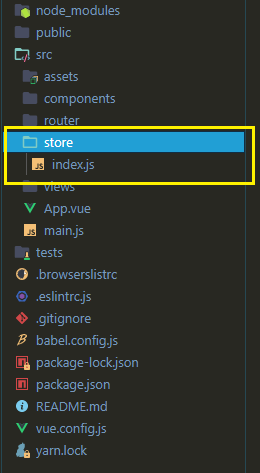
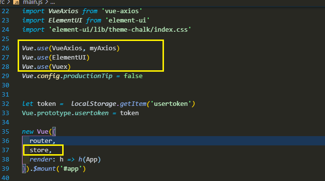

# 	Vuex的使用

Vuex 是一个专为 Vue.js 应用程序开发的**状态管理模式**。它采用集中式存储管理应用的所有组件的状态，并以相应的规则保证状态以一种可预测的方式发生变化。

个人理解就是为了解决非父子非兄弟组件间的传值，创建一个新的公共库，来存放各种变量，不用每个组件都prop或者emit来传值。不过Vuex里的值，刷新就会重置。

## 安装/引入

### npm


```npm
npm install vuex --save
```

###  Yarn

``` Yarn
yarn add vuex
```

### main.js

```js
import Vue from 'vue'
import Vuex from 'vuex'

Vue.use(Vuex)
```

## 核心概念

State:**单一状态树**,每个应用将仅仅包含一个 store 实例。

Getter: Vuex 允许我们在 store 中定义“getter”（可以认为是 store 的计算属性）。

```vue
const store = new Vuex.Store({
  state: {
    todos: [
      { id: 1, text: '...', done: true },
      { id: 2, text: '...', done: false }
    ]
  },
  getters: {
    doneTodos: state => {
      return state.todos.filter(todo => todo.done)
    }
  }
})
```


Mutations:更改 Vuex 的 store 中的状态的唯一方法是提交 mutation。每个 mutation 都有一个字符串的 **事件类型 (type)** 和 一个 				**回调函数 (handler)**。Mutations是同步操作，就是同时响应页面的值的改变。

```vue
const store = new Vuex.Store({
  state: {
    count: 1
  },
  mutations: {
    increment (state) {
      // 变更状态
      state.count++
    }
  }
})
```


Actions: Action 类似于 mutation，但是

1. Action 提交的是 mutation，而不是直接变更状态。

2. Action 可以包含任意  <font color='red'>异步  </font> 操作

   ```javascript
   const store = new Vuex.Store({
     state: {
       count: 0
     },
     mutations: {
       increment (state) {
         state.count++
       }
     },
     actions: {
       increment (context) {
         context.commit('increment')
       }
     }
   })
   ```

   

Module: Vuex 允许我们将 store 分割成**模块（module）**。每个模块拥有自己的 state、mutation、action、getter、甚至是嵌套子模块——从上至下进行同样方式的分割：

```javascript
const moduleA = {
  state: () => ({ ... }),
  mutations: { ... },
  actions: { ... },
  getters: { ... }
}

const moduleB = {
  state: () => ({ ... }),
  mutations: { ... },
  actions: { ... }
}

const store = new Vuex.Store({
  modules: {
    a: moduleA,
    b: moduleB
  }
})

store.state.a // -> moduleA 的状态
store.state.b // -> moduleB 的状态
```


## 使用流程(同步Mutations)

1. 安装，在脚手架npm / yarn

2. 在src里面建立文件夹 store ，创建文件 index.js<br/>

3. 入口文件添加以下<br/>

4. store 里的 index.js文件

   ```javascript
   import Vue from 'vue'//必须
   import Vuex from 'vuex'//必须
   
   Vue.use(Vuex)
   
   let store = new Vuex.Store({
       state: {
           userInfo:{}
       },
       mutations: {
           setUserInfo(state,v){
               state.userInfo  = v //v比较重要
           }
       },
       actions: {//异步的action 需要异步 的方法
   
       }
   })
   
   export default  store//记得 export  store 来给入口文件
   ```

   

5.写入

```javascript
 this.$store.commit('setUserInfo',你要传的值)
```


